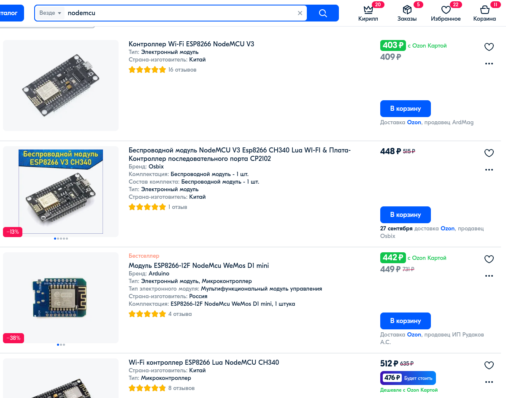

NodeMCU на ESP8266 - введение
========================

Почитав ленту и посмотрев, какие тут все умные, решил привнести тоже полезность в сообщество и запилить цикл статей, после которого любой сможет создать свой умный дом с управление через wi-fi.

Для управления периферией будем использовать микроконтроллеры на базе ESP8266. Если коротко - ESP8266 микроконтроллер 
китайского производителя <a href="https://www.espressif.com/en/products/socs/esp8266" target="_blank">Espressif Systems</a> с интерфейсом Wi-Fi.

Есть много вариаций исполнения. Вот варианты, что я у себя нашел под рукой

    Синенькие - wemos D1 (mini и R2), квадратная - тоже wemos с фоторезистором и RGB светодиодом, остальные - NodeMcu

Лично мне больше всего нравятся платы NodeMcu V3 (названия буду писать так, как они называются на aliexpress, что бы проще было искать их там).

Есть ещё микроконтроллеры ESP-01. 

Но про них я расскажу потом. Там свои тонкости, и по сути они нужны они только для двух задач - если мы хотим к обычной ардуинке добавить wi-fi интерфейс, или если нам нужно управление простейшими устройствами с одним пином. Например, одноканальным реле.

В чём ещё большая разница между esp-01 и NodeMcu - у esp-01 размер встроенной памяти составляет 512 Кб, у NodeMcu - 4 мб. И esp-01 прошивается только через программатор, тогда как NodeMcu, Wemos и т.д. прошиваются через обычный microUSB кабель.

Лично я для прошивки рекомендую использовать хороший короткий USB кабель, т.к. основные проблемы с прошивкой возникают именно из-за некачественного кабеля. Лично мне больше всего нравятся кабели от  Ugreen.

Стоят микроконтроллеры достаточно дешево, если заказывать на али.

Если заказывать кучками, то будет ещё дешевле. 

Можно заказать и на каком нибудь озоне - быстро доставят, но цена будет дороже.

Общий принцип работы микроконтроллера - программно мы можем задавать, какой сигнал мы хотим передать на пин, или с какого пина что хотим мы получить.
Схема пинов примерно следующая (на примере nodemcu V3)

Итак, с микроконтроллерами определились, вроде должно быть понятно в общих чертах что они из себя представляют и что нам понадобиться для прошивки, а теперь перейдём непосредственно к тому, как заливать прошивку и писать какой нибудь выполняемый код.

Самое простое, по чему много есть туториалов  - это использовать <a href="https://arduino-esp8266.readthedocs.io/en/latest/" target="_blank">Arduino IDE</a> (пишем на Си). Для фанатов питона - 
можно использовать <a href="https://micropython.org/" target="_blank">micropython</a>. Но лично мне нравится
<a href="https://www.nodemcu.com/index_en.html#fr_5475f7667976d8501100000f" target="_blank">NodeMcu</a> - 
прошивка с открытым исходным кодом на основе <a href="https://ru.wikipedia.org/wiki/Lua" target="_blank">Lua</a>.

Lua - язык достаточно простой. Единственное в чём у него большое отличие от других языков - первый элемент массива имеет индекс 1, тогда как в других языках - 0. Остальные конструкции плюс минус похожи.

Вся документация по NodeMcu находится <a href="https://nodemcu.readthedocs.io/en/release/" target="_blank">здесь</a>.

Хватит слов, переходим к делу.

Для начала нам нужна сама <a href="https://nodemcu.readthedocs.io/en/release/build/" target="_blank">прошивка</a>. 
Можно собрать самому на линуксах, но можно поступить проще - собрать через <a href="https://nodemcu-build.com/" target="_blank">сайт</a> 
прошивку с нужными нам модулями. Лично я пользуюсь данным вариантом. Вначале сделаем базовый пример - поморгаем встроенным в плату светодиодом, который подвязан к четвёртому пину (по типу как на ардуинке встроенный светодиод подвязан к 13 пину).

Переходим на сайт <a href="https://nodemcu-build.com/" target="_blank">https://nodemcu-build.com/</a>. 
Вводим свой email, куда придёт прошивка. Смотрим, что бы радиокнопка ветки была на release.

В списке модулей оставляем всё как есть.

И кликаем "Start your build".

Появляется сообщение, что запустился процесс сборки прошивки.

И спустя некое время к нам на почту приходит письмо с ссылками на файлы прошивки.

Есть два типа прошивок - float (поддерживает десятичные числа) и integer (работает только с целыми числами). Раньше float 
подтупливала, не знаю, как сейчас - может стало всё ок, но я рекомендую использовать всё таки integer. 
Особая точность нам не нужна, и если 7/3 = 2 - то такой ответ нас вполне устраивает.

Вначале заливаем прошивку на микроконтроллер. Для заливки прошивки из-под ubuntu я использую 
<a href="https://docs.espressif.com/projects/esptool/en/latest/esp8266/index.html" target="_blank">Esptool.py</a>. 
На сколько я понимаю, для мака и для винды это всё тоже должно <a href="https://nodemcu.readthedocs.io/en/latest/flash/" target="_blank">работать</a>.

Разместил пока прошивки на <a href="https://github.com/kvderevyanko/gk-server/tree/master/nodemcu/firmware" target="_blank">github</a>.

blank4.bin - пустой файл для перезаписи всей памяти нулями (или х.з. как это правильно называется), он служит для того, что бы можно было затереть все данные, которые могут быть на микроконтроллере. 
Иначе может что то остаться и начать глючить. Перед основной прошивкой рекомендую им очистить всю память.

И потом прошиваем прошивкой, которую мы только что собрали - nodemcu-release-7-modules-2022-09-16-06-54-45-integer.bin.
Для удобства в файле commands.txt добавил команды. Поставьте свой порт для usb, 
вместо /dev/ttyUSB0. На убунте такой по умолчанию, если не подключены ещё какие то устройства. 
Для остальных операционок - смотрите <a href="https://nodemcu.readthedocs.io/en/latest/flash/" target="_blank">здесь</a>.

<iframe width="560" height="315" src="https://www.youtube.com/embed/kqvMylgm9yo?si=X5vTN4bPE-6Em0U3" title="YouTube video player" frameborder="0" allow="accelerometer; autoplay; clipboard-write; encrypted-media; gyroscope; picture-in-picture; web-share" allowfullscreen></iframe>

Если залили прошивку - мы молодцы. Это была самая сложная часть, с которой стоит раз разобраться, запомнить, и потом не возникнет трудностей.
Для заливки файлов на микроконтроллер используем программу <a href="https://esp8266.ru/esplorer/" target="_blank">ESPlorer</a>. 
Архив с ней так же выложил на <a href="https://github.com/kvderevyanko/gk-server/tree/master/nodemcu" target="_blank">гитхаб</a>.

Можете взять от туда, или скачать с официального сайта. Работает она на java, по идее тоже должна работать под любой операционкой.

И так, после прошивки запускаем ESPlorer. Если всё ок, то сверху в выпадающем списке будет отображаться порт NodeMcu,   кликаем Open (на самом микроконтроллере скорее всего нужно будет нажать кнопку reset). И в итоге получаем лог с информацией о прошивке.

<iframe width="560" height="315" src="https://www.youtube.com/embed/1M45IY8E-GA?si=cNqDHTymay3zMnzQ" title="YouTube video player" frameborder="0" allow="accelerometer; autoplay; clipboard-write; encrypted-media; gyroscope; picture-in-picture; web-share" allowfullscreen></iframe>

Задержка, в отличии от ардуины, где она вызывается через delay(), здесь вызывается через таймеры. С одной стороны кажется что это сложно, но с другой стороны - можно без проблем запустить до 7 таймеров, которые будут выполнять асинхронный код без танцев с бубнами. Про это тоже позже расскажу.

И тут как раз показал что за файл init.lua - в нём я добавил вызов нашего файла dofile("gpio.lua"), который выполняется через 2 секунды после старта системы.

Никто не мешает прописать нам в init.lua просто dofile("gpio.lua");, и у нас наш файл запуститься сразу при старте системы. Но тут может быть проблема - если в  gpio.lua будет какая то ошибка, то микроконтроллер будет постоянно перезагружаться. А с таймером у нас будет в запасе две секунды, во время которых мы сможем спокойно послать на микроконтроллер команду, и спокойно исправить ошибку.

В общем, на этом пока всё. В следующей части мы подключим wi-fi и создадим веб интерфейс для того, что бы мы смогли включать/отключать диод с телефона/компьютера.

Скорее всего дофига чего непонятно может быть, что то я мог упустить - не стесняйтесь, спрашивайте в комментах, указывайте на ошибки, исправлю.

То что выше написал - это самая сложная часть, остальное будет проще. Дальше уже создадим веб интерфейс, будем подключать разную периферию и управлять ей.

