Запуск сервера на ESP8266 и управление GPIO и PWM через web интерефейс
========================

Ну штош, мои дорогие любители микроконтроллеров. Продолжаем постигать азы lua на ESP8266. В этот раз мы запустим сервер на микроконтроллере, подключимся к нему через браузер с компьютера/смартфона - поморгаем лампочками.
И у нас будет достаточно знаний, что бы сделать примерно такой ровер.

<a href="https://youtu.be/zVh13iJ1C7U?si=1gKKVASzJYc5P4du" target="_blank">Видео</a>

Для начала нам нужна будет прошивка, в которой помимо стандартных модулей будет ещё модуль <a href="https://nodemcu.readthedocs.io/en/release/modules/pwm/" target="_blank">PWM</a>. 
Генерим её в <a href="https://nodemcu-build.com/index.php" target="_blank">облаке</a>, или можем скачать её с <a href="https://github.com/kvderevyanko/gk-server/tree/master/nodemcu/firmware" target="_blank">гитхаба</a> 
(имя файла - "file, gpio, net, node, pwm, tmr, uart, wifi.bin" - как раз указаны имена нужных модулей). О том, как прошивать, я описал в  
посте, написанном ранее.

Что бы мы могли без проблем вносить свои изменения в конфиги и что бы у нас не было конфликтов в гите, я добавил файл _config.lua. Нужно сделать его дубликат и назвать его config.lua (файл с таким именем добавлен в .gitignore), и уже в config.lua мы сможем вносить нужные нам настройки.

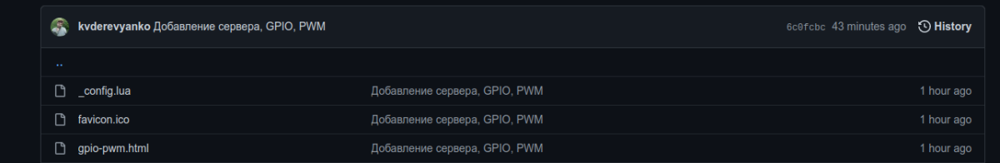

Итак, подробнее остановимся на <a href="https://github.com/kvderevyanko/gk-server/blob/master/nodemcu/code/_config.lua" target="_blank">конфиге</a> и на параметрах в нём.

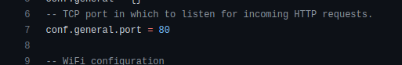

conf.general.port = 80 - порт, на котором поднят сервер. Так, как мы будем к нему подключаться через http, порт для которого по умолчанию 80, то его трогать не будем.

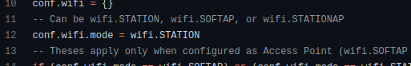

conf.wifi.mode = wifi.STATION - <a href="https://nodemcu.readthedocs.io/en/release/modules/wifi/" target="_blank">тип</a> подключения.

Их может быть три режима:

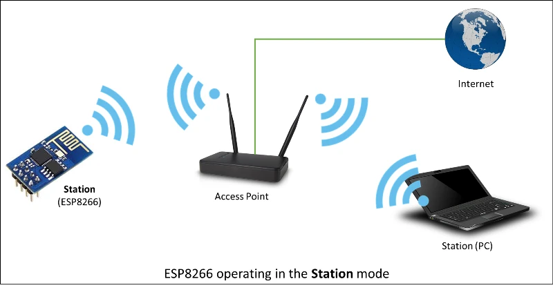

wifi.STATION - когда микроконтроллер подключается к роутеру или к другой точки доступа, и вся работа с микроконтроллером идёт через некую точку доступа. Так я обычно делаю в локальной сети.

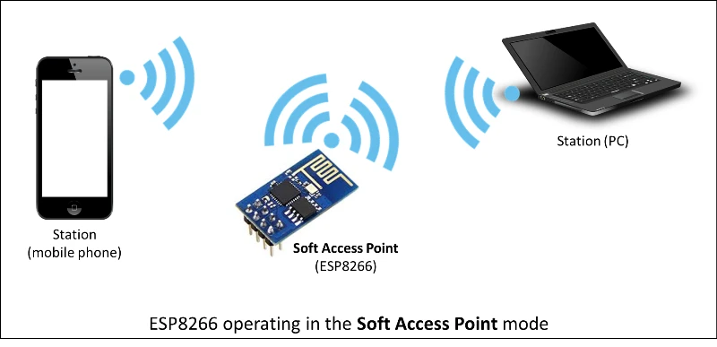

wifi.SOFTAP - когда сама esp создаёт свою точку доступа, и мы можем подключиться к ней. Удобно когда идёшь куда то в лес, на природу. Подключаешься со смартфона к esp и управляешь ей.

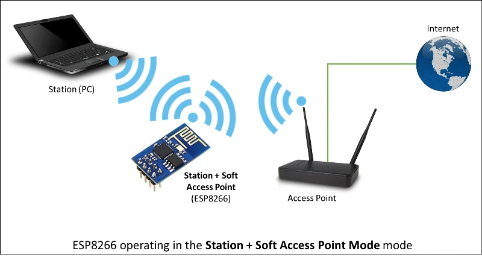

wifi.STATIONAP - когда esp одновременно работает в двух режимах - точки доступа и сама подключается к другой точки доступа. Скажу честно - его в реальности ни разу не использовал, только для тестов - ничего особенного про него сказать не могу. Использую обычно первые два.

Более подробно об этих типах расписано в <a href="https://nodemcu.readthedocs.io/en/release/modules/wifi/" target="_blank">официальной документации</a> (картинки от туда же). Там же расписано про параметры конфигурации, о которых речь пойдёт дальше.

Если мы решаем использовать esp как точку доступа (в режиме wifi.STATION), то задаём параметры в этом месте конфигурации:

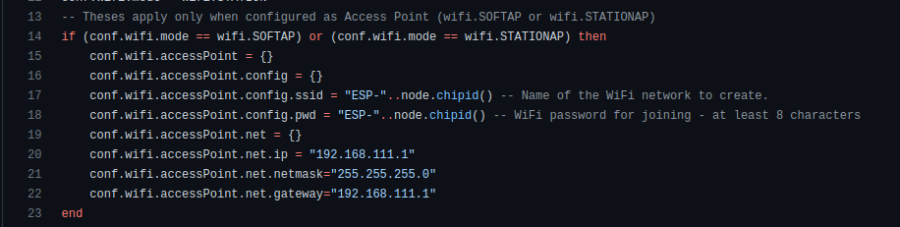

`conf.wifi.accessPoint.config.ssid` - имя wi-fi сети, которую будет создавать esp

`conf.wifi.accessPoint.config.pwd` - пароль для wi-fi сети

В данном случае пероль сети будет такой же как и имя - "ESP-"..node.chipid(). Где 
<a href="https://nodemcu.readthedocs.io/en/release/modules/node/#nodechipid" target="_blank">node.chipid()</a> - уникальное id чипа.
conf.wifi.accessPoint.net.ip - ip адрес, через который мы будем подключаться к точке доступа, который должен находится в диапазоне, указанном в conf.wifi.accessPoint.net.gateway(192.168.111.1-192.168.111.255).

И если мы запустим нашу esp с такими настройками, то мы увидим следующую картину:

<a href="https://youtu.be/tHcaJyihmt8?si=w3CsTMCKJ4sVvPLK" target="_blank">Видео</a>

В консоль нам отдаётся имя сети, пароль и ip микроконтроллера.И если мы подключимся к этой сети:

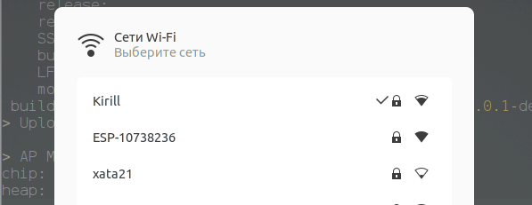

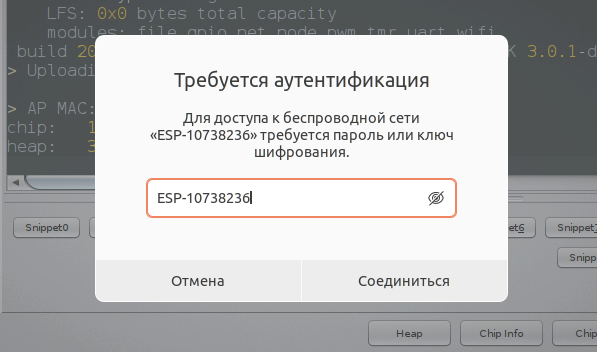

То перейдя по данному ip адресу в браузере мы попадём в веб морду микроконтроллера.

Если мы используем режим wifi.STATION - подключение к точке доступа, то настраиваем следующие параметры в конфиге:

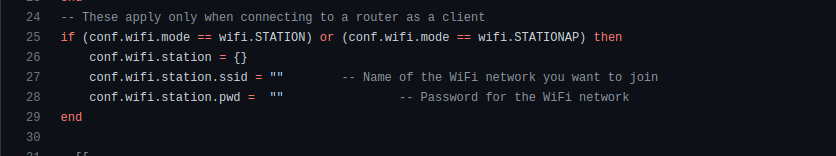

`conf.wifi.station.ssid` - имя wi-fi сети, к которой мы хотим подключиться.

`conf.wifi.station.pwd` - пароль wi-fi сети, к которой хотим подключиться.

И при таких параметрах происходит следующее:

<a href="https://youtu.be/rGTMxk8T3ec?si=fI9NRTefNtfObBME" target="_blank">Видео</a>

Микроконтроллер подключается к точке доступа. И если всё хорошо, то в консоль отдаёт ip адрес, который ему назначила точка доступа (ну или можем сами посмотреть его, к примеру - в настройках роутера, к которому мы подключаемся).

***

С настройками разобрались, а теперь попробую вкратце описать программную часть.

При старте микроконтроллера происходит вызов файла 
<a href="https://github.com/kvderevyanko/gk-server/blob/master/nodemcu/code/init.lua" target="_blank">init.lua</a>. 
В котором располагается <a href="https://nodemcu.readthedocs.io/en/release/modules/tmr/#tmrcreate" target="_blank">таймер</a>, который через две секунды после запуска один раз (параметр "tmr.ALARM_SINGLE") выполняет файл - wi-fi.lua - ( dofile("wi-fi.lua")).Почему во время отладки в  init.lua первую команду лучше запускать с таймером, я писал в предыдущей части.

Во время выполнения файла <a href="https://github.com/kvderevyanko/gk-server/blob/master/nodemcu/code/wi-fi.lua" target="_blank">wi-fi.lua</a>:

Получаем настройки из конфига - `local conf = dofile("config.lua");`

После получения настроек устанавливаем режим работы микроконтроллера (<a href="https://nodemcu.readthedocs.io/en/release/modules/wifi/#wifisetmode" target="_blank">wifi.setmode()</a>).

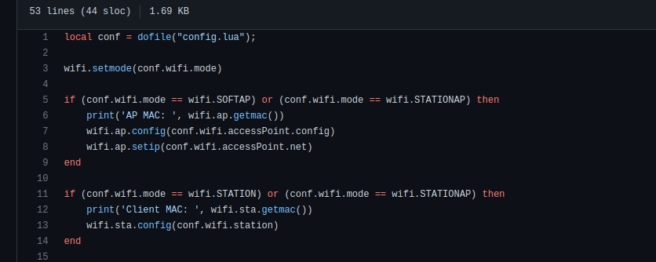

В зависимости от режима работы загружаем соответствующие настройки и показываем в консоли мак адрес.

Если мы выбрали режим работы wi-fi wifi.STATION или wifi.STATIONAP:

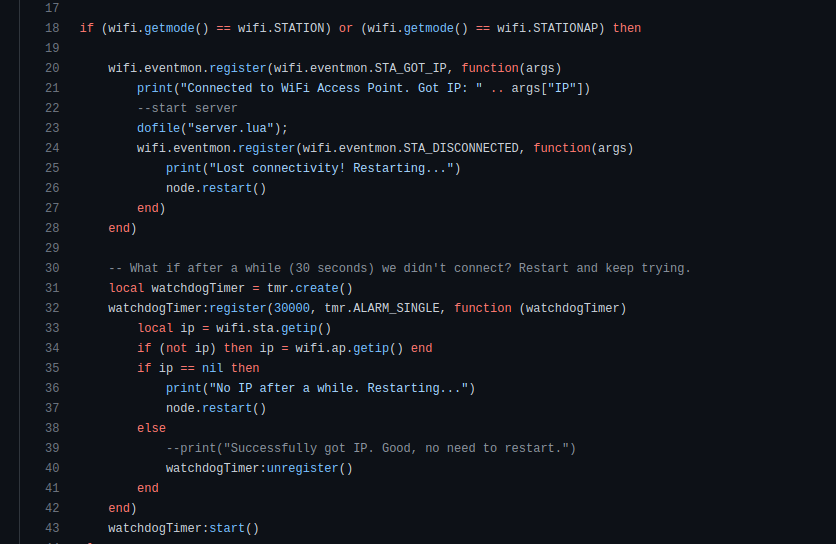

`wifi.eventmon.register(wifi.eventmon.STA_GOT_IP, function(args)` - стараемся подключиться к нашей точке доступа. Если всё ок, то отображаем ip адрес нашего подключённого устройства и выполняем файл "server.lua".

Если вдруг соединение с точкой доступа прервалось - `wifi.eventmon.register(wifi.eventmon.STA_DISCONNECTED, function(args)`, то перезагружаем наш микроконтроллер -
<a href="https://nodemcu.readthedocs.io/en/release/modules/node/#noderestart" target="_blank">node.restart()</a>, чтобы попробовать соединиться заново.

Пока происходит попытка соединения с точкой доступа запускается `watchdogTimer`. 
Таймер, который через 30 секунд проверит, получил ли микроконтроллер ip адрес от точки доступа
(`local ip = wifi.sta.getip()`). И если не получил (`if ip == nil then`), то так же делаем рестарт esp и стараемся подключиться заново.

Если у нас выбран режим wifi.STATION в конфиге, то просто выводим в консоль информацию для подключения и выполняем файл "server.lua".

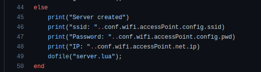

И в самом конце очищаем переменные и очищаем память микроконтроллера.

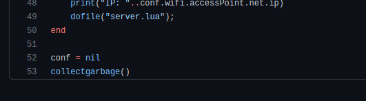

Если всё успешно с настройками wi-fi, то у нас должен выполниться файл <a href="https://github.com/kvderevyanko/gk-server/blob/master/nodemcu/code/server.lua" target="_blank">server.lua</a>.

Что в нём происходит:

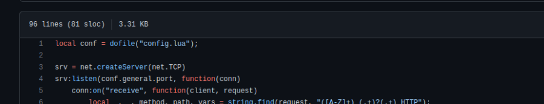

Загружаются данные из конфига.

Запускается сервер - srv = <a href="https://nodemcu.readthedocs.io/en/release/modules/net/#netcreateserver" target="_blank">net.createServer(net.TCP)</a>, 
который начинает прослушивать порт, который мы указали в конфиге (`conf.general.port` - в нашем случае 80 - по умолчанию для http).

И если приходит запрос -  `conn:on("receive", function(client, request)`, то получаем параметры, выполняем какие то действия, и что то отдаём клиенту.

Какие происходят именно действия:

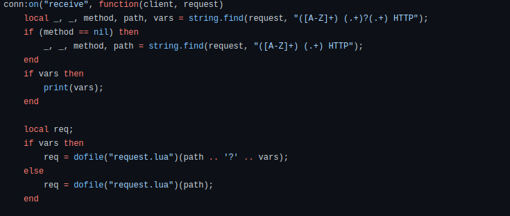

Из request получаем различные параметры, которые затем передаём в файл
<a href="https://github.com/kvderevyanko/gk-server/blob/master/nodemcu/code/request.lua" target="_blank">request.lua</a> который занимается парсингом параметров из урла запроса , что бы получить данные запроса (в переменную req).

После того, как мы распарсили запрос

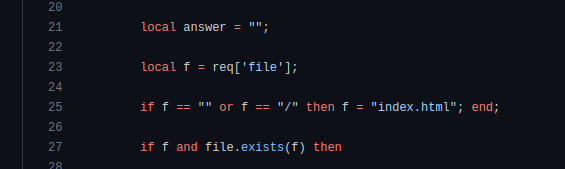

Создаём переменную answer, куда мы будем складывать строку ответа `local f = req['file'];` - стараемся получить имя из 
строки запроса файла. И если его нет (например, когда мы обращаемся по адресу http://192.168.1.16/), то указываем его - `index.html`

Проверяем, существует ли файл с таким именем на микроконтроллере - 
`if f and file.exists(f) then`. И если да, то проверяем расширение файла.

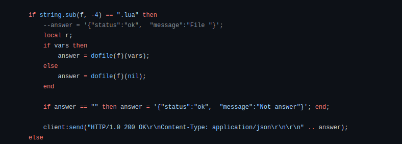

И если оно имеет расширение .lua (.lua и .lс - расширения файлов, которые запускаются на esp, пример строки запроса -
http://192.168.1.16/gpio.lua?5=0&6=300&7=200&8=0), то выполняем файл, получаем ответ, и в виде json отдаём клиенту.

Вот пример исполняемого файла, который будем вызывать по ссылке - 
<a href="https://github.com/kvderevyanko/gk-server/blob/master/nodemcu/code/gpio.lua" target="_blank">gpio.lua</a>. Подробнее, как там и что - я распишу позднее.
Если у нас какое то другое расширение - то просто отдаём как статичный файл.

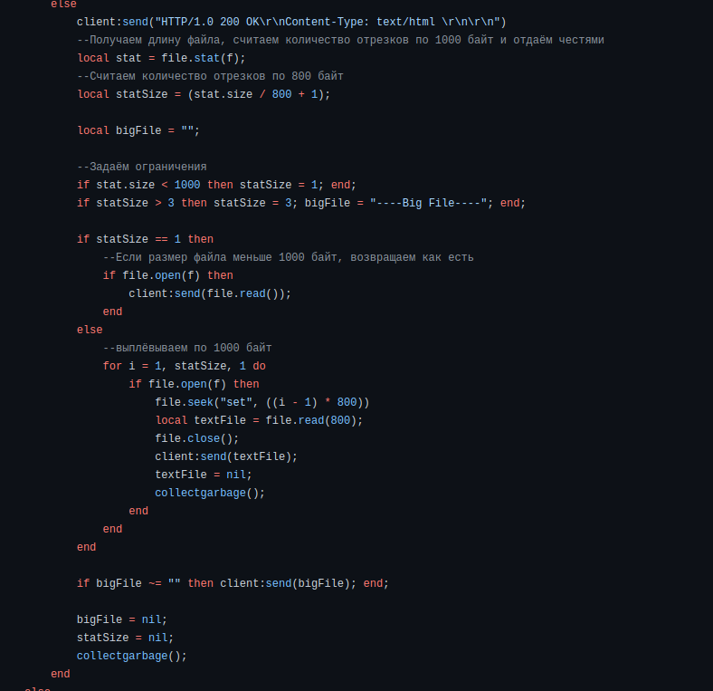

Не помню где, если найду инфу, добавлю, но у esp2866 на lua доступно только 2кб памяти, которые мы можем передать за ответ (или фиг знает, как это правильно называется) клиенту.

Не хотелось углубляться в буферы, поэтому сделал по простому:

Проверяем размер файла (количество частей по 800 байт).

Если размер файла больше чем 2400 байт (3*800), то берём из него только первые 2400 байт и передаём клиенту в цикле 3 раза по 800, и в конце добавляем строку, что это большой файл.

<a href="https://youtu.be/jPf3Ca0W480?si=kgDHyLNEaecLQ7ui" target="_blank">Видео</a>

Поэтому спокойно на микроконтроллере можем размещать обычные html, js, css файлы и прочее, и вызывать без проблем их по прямому адресу, типа http://192.168.1.16/style-gpio.css. Просто рай для фронтендеров из веба.

Сервер, про который выше написал, достаточно простой, написан буквально на коленки для ГК. Если кто то хочет попробовать хороший сервер на esp2866 - вот очень классный <a href="https://github.com/marcoskirsch/nodemcu-httpserver" target="_blank" >репозиторий</a>. Какие то вещи для этого поста взял от туда.

Можно было бы использовать и тот сервер, но там куча проверок и т.д., в итоге ответ сервера после запроса возвращается только где то через 300-500 мс. Здесь мы делаем просто, поэтому время ответа сервера в пределах 100-150мс.

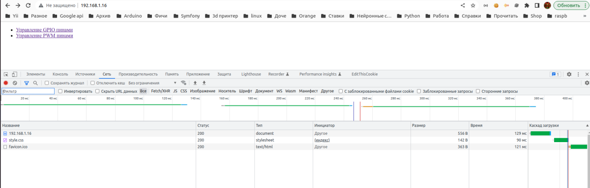

Ну и далее в файле server.lua:

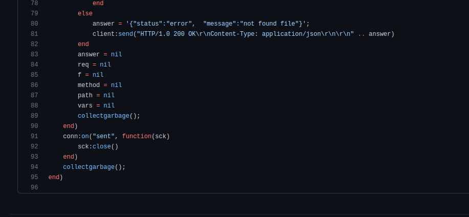

Если файл не найден на микроконтроллере - то возвращаем json с сообщением об ошибке - answer = '"status":"error", "message":"not found file"';

После этого очищаем все переменные, очищаем память микроконтроллера.

Какая общая идея будет управления микроконтроллером для управления ровером - у нас будут обычные html, js, css файлы с помощью которых мы будем формировать веб морду. И с помощью Vanilla JS и XHR будем слать запросы на микроконтроллер для выполнения файлов lua и получения каких то результатов.

***

С теорией сервера покончено. Можно в неё вообще не углубляться, а просто принять как должное. Я сам вначале писал только фронтенд и исполняемые ".lua" файлы, а как работает сервер разобрался только потом.

Далее перейдём к практике. Но так, как эта статья получилась и так огромная, остальное продолжу в следующей статье. Код в репозитории по управлению выложил уже, все видосы записал.

Например:

<a href="https://youtu.be/SEvdoQaXeWI?si=xH24sDrCKD_Bd5fI" target="_blank">Видео</a>

